# Functions of functions and the exponential function

## Exponential growth and decline

> Exponential growth is typically expressed as:
> 
>  $y(t)=Ae^{kt}$
> 
> 
> 
> 
> Figure: Exponential growth curve

### Details

> **Definition**:  
> 
> **Exponential growth** is the rate of population increase across time
> when a population is devoid of limiting factors (i.e. competition,
> resources, etc.) and experiences a constant growth rate.

Exponential growth is typically expressed as:

 $y(t)=Ae^{kt}$

where\
 $A$
 (sometimes denoted  $P$
)=initial population size\
 $k$
= growth rate\
 $t$
 =number of time intervals

> **Note**:  
> 
> *Note 10*. Note that exponential growth occurs when  $k>0$
>  and
> exponential decline occurs when  $k<0$
> .

## The exponential function

> An exponential function is a function with the form:  $f(x)=b^x$
> 

### Details

For the exponential function  $f(x)=b^x$
,  $x$
 is a positive integer and
 $b$
 is a fixed positive real number. The equation can be rewritten as:

$$f(x)=b^x=b\cdot b \cdot b \cdot \dots \cdot b.$$

When the exponential function is written as  $f(x)=e^x$
 then, it has a
growth rate at time  $x$
 equivalent to the value of  $e^x$
 for the
function at  $x$
.

## Properties of the exponential function

> Recall that the methods of the basic arithmetic implies that:
> 
> $$e^{a+b} = e^a e^b$$
> 
>  for any real numbers  $a$
>  and  $b$
> .

## Functions of functions

### Details

Consider two functions,  $f$
 and  $g$
, each defined for some set of real
numbers. Where  $x$
 can be solved in function  $f$
 using  $Y = f(x)$
 when
 $g(Y)$
 exists for all such resulting  $y$
. If  $y = f(x)$
 and  $g(y)$
 exist
then we can compute  $g(f(x))$
 for any  $x$
.

If  $f(x) = {x}^2$
 and  $g(y)= {e}^y$
, then

$$g(f(x))= {e}^{f(x)} = {e}^{x^2}.$$

If we call the resulting function  $h$
, then  $h(x) = g(f(x))$
. Another
common notation for this is 

$$h = g\circ f.$$

### Examples

> **Example**:  
> 
> If  $g(x)= {3}+ {2}x$
>  and  $f(x) = {5}{x}^2$
> , then
> 
> $$g(f(x)) = {3} +{2} f(x) = {3} +{10x}^2,$$
> 
>  and
> 
> $$f(g(x)) = {5}{(g(x))}^2 = {5}{({3}+{2x})}^2 = {45}+{60x}+{20x}^2.$$
> 

## Storing and using R code

> As R code gets more complex (more lines) it is usually stored in files.
> Functions are typically stored in separate files.

### Examples

> **Example**:  
> 
> Save the following file ( $\verb|test.r|$
> ):
> 
>     x=4
>     y=8
>     cat("x+y is", x+y, "\n")
> 
> To read the file use:
> 
>     source("test.r")
> 
> and the outcome of the equation is displayed in R

## Storing and calling functions in R

> To save a function in a separate file use a command of the form
>  $\verb|function.r|$
> .

### Examples

> **Example**:  
> 
>     f<-function(x) {
>         return (exp(sum(x)))
>         }
> 
> can be stored in a file function.r and subsequently read using the
> source command.

**Copyright** 2021, Gunnar Stefansson (editor) with contributions from
very many students

This work is licensed under the Creative Commons Attribution-ShareAlike
License. To view a copy of this license, visit
http://creativecommons.org/licenses/by-sa/1.0/ or send a letter to
Creative Commons, 559 Nathan Abbott Way, Stanford, California 94305,
USA.

# Inverse functions and the logarithm

## Inverse Function

> If  $f$
>  is a function, then the function  $g$
>  is the inverse function of
>  $f$
>  if 
> 
> $$g(f(x))=x$$
> 
> for all  $x$
>  in which  $f(x)$
>  can be calculated

### Details

The inverse of a function  $f$
 is denoted by  $f^{-1}$
, i.e.

$$f^{-1}(f(x))=x$$

### Examples

> **Example**:  
> 
> If  $f(x) = x^2$
>  for  $x<0$
>  then the function  $g$
> , defined as
>  $g(y)=\sqrt{y}$
>  for  $y>0$
> , is not the inverse of  $f$
>  since
>  $g(f(x))=\sqrt{x^2}= |x|= -x$
>  for  $x<0$
> .

## When the inverse exists: The domain question

> Inverses do not always exist. For an inverse of  $f$
>  to exist,  $f$
>  must
> be one-to-one, i.e. for each  $x$
> ,  $f(x)$
>  must be unique.
> 
> 
> 
> Figure: The function  $f(x)=x^2$
>  does not have an inverse since  $f(x)=1$
> 
> has two possible solutions  $-1$
>  and  $1$
> .

### Examples

> **Example**:  
> 
>  $f(x)=x^2$
>  does not have an inverse since  $f(x)=1$
>  has two possible
> solutions -1 and 1.

> **Note**:  
> 
> *Note 11*. Note that iff  $f$
>  is a function, then the function  $g$
>  is the
> inverse function of  $f$
> , if  $g(f(x)) = x$
>  for all calculated values of
>  $x$
>  in  $f(x)$
> .\
> The inverse function of  $f$
>  is denoted by  $f^{-1}$
> , i.e.
>  $f^{-1}(f(x)) = x$
> .

> **Example**:  
> 
> What is the inverse function,  $f^{-1}$
> , of  $f$
>  if  $f(x) = 5 + 4x$
> .\
> The simplest approach is to write  $y=f(x)$
>  and solve for  $x$
> :
> 
> With 
> 
> $$f(x) = 5 + 4x$$
> 
> we write 
> 
> $$y = 5 + 4x$$
> 
> which we can now rewrite as 
> 
> $$y - 5 = 4x$$
> 
> and this implies 
> 
> $$\frac{y-5}{4} = x$$
> 
> And there we have it, very simple:
> 
> $$f^{-1}(f(x)) = \frac{y - 5}{4}$$
> 

## The base 10 logarithm

> When  $x$
>  is a positive real number in  $x=10^y$
> ,  $y$
>  is referred to as
> the base 10 logarithm of x and is written as: 
> 
> $$y=\log_{10}(x)$$
> 
> or 
> 
> $$y=\log(x)$$
> 

### Details

If  $\log (x) = a$
 and  $\log (y)=b$
, then  $x = 10^a$
 and  $y = 10^b$
, and

$$x \cdot y = 10^a \cdot 10^b = 10^{a+b}$$

 so that 

$$\log(xy) = a+b$$

### Examples

> **Example**:  
> 
> 
> $$\begin{aligned}
> \log(100)&=& 2 \\
> \log(1000)&=& 3\end{aligned}$$
> 

> **Example**:  
> 
> If 
> 
> $$\log(2) \approx 0.3$$
> 
> then 
> 
> $$10^y=2$$
> 
> > **Note**:  
> > 
> > *Note 12*. Note that 
> > 
> > $$2^{10}=1024 \approx 1000 = 10^3$$
> > 
> > therefore 
> > 
> > $$2 \approx 10^{3/10}$$
> > 
> > so 
> > 
> > $$\log (2) \approx 0.3$$
> > 

## The natural logarithm

> A logarithm with  $e$
>  as a base is referred to as the natural logarithm
> and is denoted as  $\ln$
>  : 
> 
> $$y=\ln(x)$$
> 
> if 
> 
> $$x=e^y=\exp(y)$$
> 
> Note that  $\ln$
>  is the inverse of  $\exp$
> .
> 
> 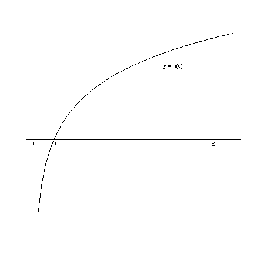
> 
> Figure: The curve depicts the fuction  $y=\ln(x)$
>  and shows that  $\ln$
>  is
> the inverse of  $\exp$
> . Note that  $\ln(1)=0$
>  and when  $y=0$
>  then  $e^0=1$
> .

## Properties of logarithm(s)

> Logarithms transform multiplicative models into additive models, i.e.
> 
> $$\ln(a\cdot b) = \ln a + \ln b$$
> 

### Details

This implies that any statistical model, which is multiplicative becomes
additive on a log scale, e.g.

$$y = a \cdot w^b \cdot x^c$$

$$\ln y = (\ln a) + \ln (w^b) + \ln (x^c)$$

Next, note that

$$\begin{aligned}
\ln (x^2)&=& \ln (x \cdot x)\\
&=& \ln x + \ln x\\
&=& 2 \cdot \ln x\end{aligned}$$

and similarly  $\ln (x^n) = n \cdot \ln x$
 for any integer  $n$
.

In general  $\ln (x^c) = c \cdot \ln x$
 for any real number c (for
 $x>0$
).

Thus the multiplicative model (from above)

$$y=a \cdot w^b \cdot x^c$$

becomes 

$$y= (\ln a) + b \cdot \ln w + c \cdot \ln x$$

 which is a linear
model with parameters  $(\ln a)$
,  $b$
 and  $c$
.

In addition, the log-transform is often variance-stabilizing.

## The exponential function and the logarithm

> The exponential function and the logarithms are inverses of each other
> 
> $$x = e^y \Leftrightarrow y = \ln{x}$$
> 

### Details

> **Note**:  
> 
> *Note 13*. Note the properties:
> 
> $$\ln (x \cdot y) = \ln (x) + \ln (y)$$
> 
> and 
> 
> $$e^a \cdot e^b = e^{a+b}$$
> 

### Examples

> **Example**:  
> 
> Solve the equation 
> 
> $$10e^{1/3x} + 3 = 24$$
> 
> for  $x$
> .
> 
> First, get the  $3$
>  out of the way.
> 
> $$10e^{1/3x} = 21$$
> 
> Then the  $10$
> .
> 
> $$e^{1/3x} = 2.1$$
> 
> Next, we can take the natural log of 2.1. Since  $\ln$
>  is an inverse
> function of  $e$
>  this would result in
> 
> $$\frac{1}{3}x = \ln(2.1)$$
> 
> This yields 
> 
> $$x = \ln(2.1) \cdot 3$$
> 
> which is 
> 
> $$\approx 2.23$$
> 

**Copyright** 2021, Gunnar Stefansson (editor) with contributions from
very many students

This work is licensed under the Creative Commons Attribution-ShareAlike
License. To view a copy of this license, visit
http://creativecommons.org/licenses/by-sa/1.0/ or send a letter to
Creative Commons, 559 Nathan Abbott Way, Stanford, California 94305,
USA.

# Continuity and limits

## The concept of continuity

> A function is continuous if it has no jumps. Thus, small changes in each
>  $x_0$
> , the input, correspond to small changes in the output,  $f(x_0)$
> .
> 
> 
> 
> Figure: The above figure is an example of linear growth. Thomas Robert
> Malthus (1766-1834) warned about the dangers of uninhibited population
> growth.

### Details

A function is said to be discontinuous if it has jumps. The function is
continuous if it has no jumps. Thus, for a continuous function, small
changes in each  $x_0$
, the input, correspond to small changes in the
output,  $f(x_0)$
.

> **Note**:  
> 
> *Note 14*. Note that polynomials are continuous as are logarithms (for
> positive numbers).

## Discrete probabilities and cumulative distribution functions

> The cumulative distribution function for a discrete random variable is
> discontinuous.
> 
> 

### Details

> **Definition**:  
> 
> If  $X$
>  is a random variable with a discrete probability distribution and
> the probability mass function of 
> 
> $$p(x)=P[X=x]$$
> 
>  then the **cumulative
> distribution function**, defined by 
> 
> $$F(X)=P[X\leq x]$$
> 
>  is
> discontinuous, i.e. it jumps at points in which a positive probability
> occurs.

> **Note**:  
> 
> *Note 15*. When drawing discontinuous functions it is common practice to
> use a filled circle at  $(x,f(x))$
>  to clarify what the function value is
> at a point  $x$
>  of discontinuity.

### Examples

> **Example**:  
> 
> If a coin is tossed three independent times and  $X$
>  denotes the number
> of heads, then  $X$
>  can only take on the values  $0$
> ,  $1$
> ,  $2$
>  and  $3$
> .
> The probability of landing exactly  $x$
>  heads,  $P(X=x)$
> , is
>  $p(x) = \binom{n}{x} p^n (1-p)^{n-x}$
> . The probabilities are
> 
> $$\begin{array}{c c c}
> \hline
> x & p(x) & F(x)\\
> \hline
> 0 & \frac{1}{8} & \frac{1}{8}\\
> 1 & \frac{3}{8} & \frac{4}{8}\\
> 2 & \frac{3}{8} & \frac{7}{8}\\
> 3 & \frac{1}{8} & 1\\
> \hline
> \end{array}$$
> 
> The cumulative distribution function,
>  $F(x)=P[X \leq x] = \sum_{t\leq x} p(t)$
>  has jumps and is therefore
> discontinuous.
> 
> > **Note**:  
> > 
> > *Note 16*. Notice on the above figure how the circles are filled in, the
> > solid circles indicate where the function value is.

## Notes on discontinuous function

> A function is discontinuous for values or ranges of the variable that do
> not vary continuously as the variable increases. In other words, breaks
> or jumps.
> 
> 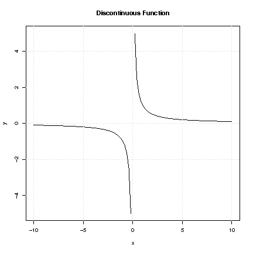
> 
> Figure:  $f(x) = \frac{1}{x}$
> , where  $x\neq 0$
> 

### Details

A function can be discontinuous in a number of different ways. Most
commonly, it may jump at certain points or increase without bound in
certain places.\
Consider the function  $f$
, defined by  $f(x)= 1/x$
 when  $x\neq 0$
.
Naturally,  $1/x$
 is not defined for  $x=0$
. This function increases
towards  $+\infty$
 as  $x$
 goes to zero from the right but decreases to
 $-\infty$
 as  $x$
 goes to zero from the left. Since the function does not
have the same limit from the right and the left, it cannot be made
continuous at  $x=0$
 even if one tries to define  $f(0)$
 as some number.

## Continuity of polynomials

> All polynomials,  $p(x)=a_0+a_1x+a_2x^2+\ldots +a_n x^n ,$
>  are
> continuous.
> 
> 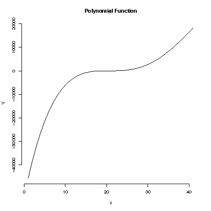

### Details

It is easy to show that simple polynomials such as  $p(x)=x$
,
 $p(x)=a+bx$
,  $p(x)=ax^2+bx+c$
 are continuous functions.\
It is generally true that a polynomial of the form

$$p(x)=a_0+a_1x+a_2x^2+\ldots +a_n x^n$$

 is a continuous function.

## Simple Limits

> A **limit** is used to describe the value that a function or sequence
> approaches as the input or index approaches some value. Limits are used
> to define continuity, derivatives and integrals.
> 
> 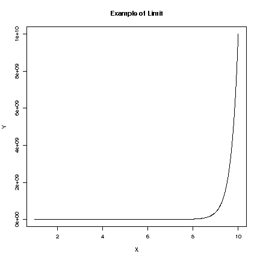
> 
> Figure:  $f(x) = x^x$
> , for  $x>0$
> 

### Details

> **Definition**:  
> 
> A **limit** describes the value that a function or sequence approaches
> as the input or index approaches some value.

Limits are essential to calculus (and mathematical analysis in general)
and are used to define continuity, derivatives and integrals.\
Consider a function  $f(x)$
 and a point  ${x}_0$
. If  $f(x)$
 gets steadily
closer to some number  $c$
 as  $x$
 gets closer to a number  $x_0$
, then  $c$

is called the limit of  $f(x)$
 as  $x$
 goes to  $x_0$
 and is written as:

$$c= \lim_{x\to x_0}f(x)$$

If  $c = f(x_0)$
 then  $f$
 is **continuous** at  $x_0$
.

### Examples

> **Example**:  
> 
> A simple example of limits:
> 
> Evaluate the limit of  $f(x) = \frac{x^{2}-16}{x-4}$
>  when
>  $x\rightarrow 4$
> , or
> 
> $$\lim_{x\rightarrow 4} \frac{x^{2}-16}{x-4}.$$
> 
> Notice that in principle we cannot simply stick in the value  $x=4$
>  since
> we would then get  $0/0$
>  which is not defined. However we can look at the
> numerator and try to factor it.
> 
> This gives us:
> 
> $$\frac{x^{2}-16}{x-4} = \frac{(x-4)(x+4)}{x-4} = x +4$$
> 
> and the result has the obvious limit of  $4+4=8$
>  as  $x\to 4$
> .

> **Example**:  
> 
> Consider the function
> 
> $$g (x ) =  \frac{1}{x}$$
> 
> where  $x$
>  is a positive real number. As  $x$
>  increases,  $g(x)$
>  decreases,
> approaching  $0$
>  but never getting there since  $\frac{1}{x}=0$
>  has no
> solution. One can therefore say: "The limit of  $g(x)$
> , as  $x$
>  approaches
> infinity, is  $0$
> ," and write 
> 
> $$\lim_{x\to\infty} g(x)=0.$$
> 

## More on limits

> Limits impose a certain range of values that may be applied to the
> function.
> 
> 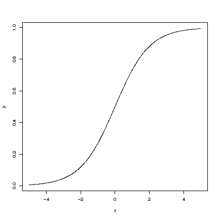
> 
> Figure: The function  $f(x)= \frac{1}{1+e^{-x}}$
> .

### Examples

> **Example**:  
> 
> The Beverton-Holt stock recruitment curve is given by:
> 
> $$R=\frac{\alpha S}{1+\frac{S}{K}}$$
> 
> where  $\alpha, K >0$
>  are constants and  $S$
>  is biomass and  $R$
>  is
> recruitment.\
> The behavior of this curve as  $S$
>  increases  $S\rightarrow\infty$
>  is
> 
> $$\lim_{S\to\infty}\frac{\alpha S}{1+\frac{S}{K}} =\alpha K .$$
> 
>  This is
> seen by rewriting the formula as follows:
> 
> $$\lim_{S\to\infty}\frac{\alpha S}{1+\frac{S}{K}} =
> \lim_{S\to\infty}\frac{\alpha }{\frac{1}{S}+\frac{1}{K}} =\alpha K .$$
> 

> **Example**:  
> 
> A popular model for proportions is: 
> 
> $$f(x) = \frac{1}{1+e^{-x}}$$
> 
> As x increases,  $e^{-x}$
>  decreases which implies that the term
>  $1+e^{-x}$
>  decreases and hence  $\frac{1}{1+e^{-x}}$
>  increases, from
> which it follows that  $f$
>  is an increasing function.
> 
> Notice that  $f(0)=\frac{1}{2}$
>  and further,
> 
> $$\lim_{x\to\infty} f(x) = 1.$$
> 
>  This is seen from considering the
> components:\
> Since  $e^{-x} = \frac{1}{e^{x}}$
>  and the exponential function goes to
> infinity as  $x\to\infty$
> ,  $e^{-x}$
>  goes to  $0$
>  and hence  $f(x)$
>  goes to
> 1.\
> Through a similar analysis one finds that
> 
> $$\lim_{x\to-\infty} f(x)=0 ,$$
> 
> since, as  $x\rightarrow \infty$
> , first  $-x\rightarrow \infty$
>  and second
>  $e^{-x} \rightarrow \infty$
> .

> **Example**:  
> 
> Evaluate the limit of  $f(x) = \frac{\sqrt{x + 4} - 2}{x}$
>  as  $x \to 0$
> ,
> i.e. solve
> 
> $$\lim_{x \to 0} \frac{\sqrt{x + 4} - 2}{x}.$$
> 
> Since there is an  $x$
>  in the denominator we cannot just direct
> substitute the 0 as  $x$
>  sunce that would give us  $\frac{0}{0}$
> , which is
> an indeterminate form. We must do some algebra first. The square root
> makes this a little bit tricky. The way to get rid of the radical is to
> multiply the numerator by the conjugate.
> 
> $$\frac{\sqrt{x + 4} - 2}{x} \cdot \frac{\sqrt{x + 4} + 2}{\sqrt{x + 4} + 2}$$
> 
> This gives us
> 
> $$\frac{(\sqrt{x + 4})^2 + 2(\sqrt{x+4}) - 2(\sqrt{x+4}) -4}{x(\sqrt{x + 4} + 2)}$$
> 
> The numerator reduces to  $x$
> , and the  $x$
> 's will cancel out leaving us
> with 
> 
> $$\frac{1}{\sqrt{x + 4} + 2}$$
> 
> At this point we can direct substitute 0 for  $x$
> , which will give us
> 
> $$\frac{1}{\sqrt{0 + 4} + 2}$$
> 
> Therefore, 
> 
> $$\lim_{x \to 0} \frac{\sqrt{x + 4} - 2}{x} = \frac{1}{4}$$
> 

## One-sided limits

>  $f(x)$
>  may tend towards different numbers depending on whether  $x$
> 
> approaches  $x_0$
>  from left or right, usually written:
> 
>  $x \rightarrow x_{0+}$
>  (from the right)
> 
>  $x \rightarrow x_{0-}$
>  (from the left).
> 
> 

### Details

Sometimes a function is such that  $f(x)$
 tends to different numbers
depending on whether  $x \rightarrow x_0$
 from the right
( $x \rightarrow x_{0+}$
) or from the left ( $x \rightarrow x_{0-}$
).\
If 

$$\lim_{x \to x_{0+}} f(x)=f(x_0)$$

 then we say that  $f$
 is
continuous from the right at  $x_0$
. Same thing goes for the limit from
the left. In order for the limit to exist at the point (that is the
overall limit, regardless og direction) then it must hold true that

$$\lim_{x \to x_{0-}} = \lim_{x to x_{0+}}$$

i.e., the limit is the same from both directions.

**Copyright** 2021, Gunnar Stefansson (editor) with contributions from
very many students

This work is licensed under the Creative Commons Attribution-ShareAlike
License. To view a copy of this license, visit
http://creativecommons.org/licenses/by-sa/1.0/ or send a letter to
Creative Commons, 559 Nathan Abbott Way, Stanford, California 94305,
USA.

# Sequences and series

## Sequences

> A **sequence** is a string of indexed numbers  $a_1, a_2, a_3, \ldots$
> .
> We denote this sequence with  $(a_n)_{n\geq1}$
> .

### Details

In a sequence the same number can appear several times in different
places.

### Examples

> **Example**:  
> 
>  $(\frac{1}{n})_{n\geq1}$
>  is the sequence
>  $1,\frac{1}{2}, \frac{1}{3}, \frac{1}{4}, \ldots$
> .

> **Example**:  
> 
>  $(n)_{n\geq1}$
>  is the sequence  $1,2,3,4,5,\ldots$
> .

> **Example**:  
> 
>  $(2^nn)_{n\geq1}$
>  is the sequence  $2,8, 24, 64,\ldots$
> .

## Convergent sequences

> A sequence  $a_n$
>  is said to **converge** to the number  $b$
>  if for every
>  $\varepsilon >0$
>  we can find an  $N\in \mathbb{N}$
>  such that
>  $|a_n-b| < \varepsilon$
>  for all  $n \geq N$
> . We denote this with
>  $\lim_{n\to\infty}a_n=b$
>  or  $a_n\to b$
> , as  $n\to\infty$
> .

### Details

A sequence  $a_n$
 is said to **converge** to the number  $b$
 if for every
 $\varepsilon >0$
 we can find an  $N\in \mathbb{N}$
 such that
 $|a_n-b| < \varepsilon$
 for all  $n \geq N$
. We denote this with
 $\lim_{n\to\infty}a_n=b$
 or  $a_n\to b$
, as  $n\to\infty$
.

If  $x$
 is a number then,

 $(1 + \frac{x}{n})^n \rightarrow e^x$
 as  $n\rightarrow\infty$

### Examples

> **Example**:  
> 
> The sequence  $(\frac{1}{n})_{n\geq\infty}$
>  converges to  $0$
>  as
>  $n\to\infty$
> 

> **Example**:  
> 
> If x is a number then,
> 
>  $(1 + \frac{x}{n})^n \rightarrow e^x$
>  as  $n\rightarrow\infty$
> 

## Infinite sums (series)

> We are interested in, whether infinite sums of sequences can be defined.

### Details

Consider a sequence of numbers,  $(a_n)_{n\to\infty}$
.

Now define another sequence  $(s_n)_{n\to\infty},$
 where

$$s_n=\sum_{k=1}^na_k.$$

If  $(s_n)_ {n\to\infty}$
 is convergent to  $S=\lim_{n\to\infty}s_n,$
 then
we write 

$$S=\sum_{n=1}^{\infty}a_n.$$

### Examples

> **Example**:  
> 
> If 
> 
> $$a_k = x^k, qquad k=0,1,\dots$$
> 
> \
> then 
> 
> $$s_n=\sum_{k=0}^{n}x^k=x^0+x^1+\dots .+x^n$$
> 
>  Note also that
> 
> $$xs_n=x(x^0+x^1+\dots .+x^n)= x + x^2 + \dots  + x^{n+1}$$
> 
>  We have
> 
> $$s_n = 1 + x + x^2 + \dots  + x^n$$
> 
> 
> 
> $$xs_n = x + x^2 + \dots  +x^n + x^{n+1}$$
> 
> 
> 
> $$s_n – xs_n = 1 - x^{n+1}$$
> 
>  i.e. 
> 
> $$s_n(1-x) = 1-x^{n+1}$$
> 
>  and we have
> 
> $$s_n =\frac{1-x^{n+1}}{1-x}$$
> 
>  if  $x\neq1$
> . If  $0< x<1$
>  then
>  $x^{n+1}\to 0$
>  as  $n\to\infty$
>  and we obtain  $s_n\to\frac{1}{1-x}$
>  so
> 
> $$\sum_{n=0}^{\infty}x^n=\frac{1}{1-x}.$$
> 

## The exponential function and the Poisson distribution

> The exponential function can be written as a series (infinite sum):
> 
> $$e^x=\sum_{n=0}^{\infty}\frac{x^n}{n!}.$$
> 
> The Poisson distribution is defined by the probabilities
> 
> $$p(x)=e^{-\lambda}\frac{\lambda^x}{x!}\textrm{ for } x=0,\ 1,\ 2,\ \ldots$$
> 

### Details

The exponential function can be written as a series (infinite sum):

$$e^x=\sum_{n=0}^{\infty}\frac{x^n}{n!}.$$

Knowing this we can see why the Poisson probabilities

$$p(x)=e^{-\lambda}\frac{\lambda^x}{x!}$$

add to one:

$$\sum_{x=0}^{\infty}p(x)=\sum_{x=0}^{\infty}e^{-\lambda}\frac{\lambda^x}{x!}=e^{-\lambda}\sum_{x=0}^{\infty}\frac{\lambda^x}{x!}=e^{-\lambda}e^{\lambda}=1.$$

## Relation to expected values

> The expected value for the Poisson is given by
> 
> $$\begin{aligned}
> \sum_{x=0}^\infty x p(x) &=& \sum_{x=0}^\infty x e^{-\lambda} \frac{\lambda^x}{x!} \\
>                          &=& \lambda\end{aligned}$$
> 

### Details

The expected value for the Poisson is given by

$$\begin{aligned}
\sum_{x=0}^\infty x p(x) &=& \sum_{x=0}^\infty x e^{-\lambda} \frac{\lambda^x}{x!} \\
                         &=& e^{-\lambda} \sum_{x=1}^\infty   \frac{x\lambda^x}{x!} \\
                         &=& e^{-\lambda} \sum_{x=1}^\infty   \frac{\lambda^x}{(x-1)!} \\
                         &=& e^{-\lambda} \lambda \sum_{x=1}^\infty   \frac{\lambda^{(x-1)}}{(x-1)!} \\
                         &=& e^{-\lambda} \lambda \sum_{x=0}^\infty   \frac{\lambda^{x}}{x!} \\
                         &=& e^{-\lambda} \lambda  e^{\lambda}\\
                         &=& \lambda\end{aligned}$$

**Copyright** 2021, Gunnar Stefansson (editor) with contributions from
very many students

This work is licensed under the Creative Commons Attribution-ShareAlike
License. To view a copy of this license, visit
http://creativecommons.org/licenses/by-sa/1.0/ or send a letter to
Creative Commons, 559 Nathan Abbott Way, Stanford, California 94305,
USA.

# Slopes of lines and curves

## The slope of a line

> Linear functions produce straight-line graphs. In general, a straight
> line follows the following equation: 
> 
> $$y = a + bx ,$$
> 
>  where  $a$
>  and  $b$
> 
> are fixed numbers.
> 
> The line on the graph is the set of points:
> 
> $$\left \\{ (x,y):   x,y \in \mathbb{R}, y = a+bx\right \\} .$$
> 
> 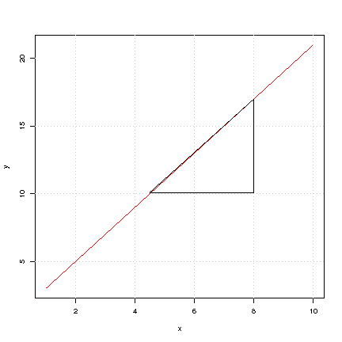

### Details

The slope of a straight line represents the change in the  $y$
 coordinate
corresponding to a unit change in the  $x$
 coordinate.

## Segment slopes

> Let's assume we have a more general function
> 
>  $y = f(x)$
> .\
> To find the slope of a line segment, consider two  $x$
> -coordinates;  $x_0$
> 
> and  $x_1$
> , and look at the slope between  $(x_0, f(x_0))$
>  and
>  $(x_1, f(x_1))$
> .
> 
> 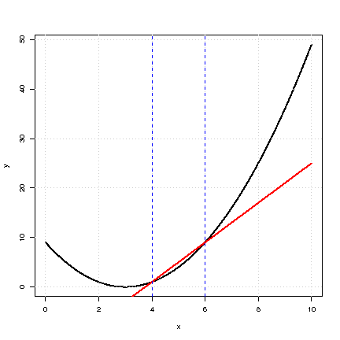

### Details

Consider two points,  $(x_0,y_0)$
 and  $(x_1,y_1)$
. The slope of the
straight line that goes through these points is

$$\frac {y_1 - y_0} {x_1 - x_0} .$$

Thus, the slope of a line segment passing throught the points
 $(x_0,f(x_0))$
 and  $(x_1,f(x_1))$
, for some function,  $f$
, is

$$\frac {f(x_1) - f(x_0)} {x_1 - x_0}$$

If we let  $x_1 = x_0 + h$
 then the slope of the segment is

$$\frac {f(x_0+h) - f(x_0)} {h} .$$

## The slope of  $y=x^2$

> Consider the task of computing the slope of the function  $y=x^2$
>  at a
> given point.
> 
> 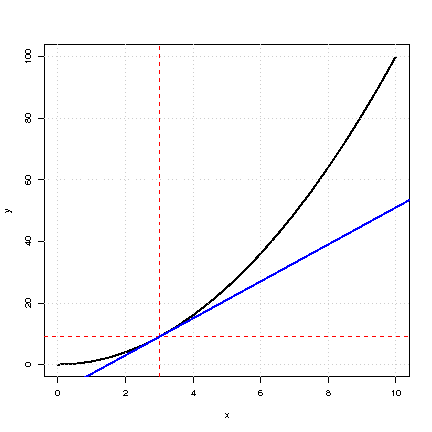

### Examples

Consider the function  $y = f(x) = x^2$
.\
In order to find the slope at a given point  $(x_0 )$
, we look at

$$y = \frac{f (x_0 +h) - f(x_0)} {h}$$

for small values of  $h$
.\
For this particular function,  $f (x) = x^2$
, and hence

$$f (x_0 +h) = (x_0 +h) ^2  = x^2 + 2hx_0 + h^2 .$$

The slope of a line segment is therefore given by

$$\frac{f (x_0 +h) - f(x_0)} {h}= \frac{2hx_0 + h^2} {h} = 2x_0 + h .$$

As we make  $h$
 steadily smaller, the segment slope,  $2x_0 + h$
, tends
towards  $2x_0$
. It follows that the slope,  $y'$
, of the curve *at a
general point*  $x$
 is given by  $y' = 2x$
.

## The tangent to a curve

> A **tangent** to a curve is a line that intersects the curve at exactly
> one point. The slope of a tangent for the function  $y=f(x)$
>  at the point
>  $(x_0,f(x_0))$
>  is 
> 
> $$\lim_{h\to0}\frac{f(x_0+h)-f(x_0)}{h}.$$
> 
> 

### Details

To find the slope of the tangent to a curve at a point, we look at the
slope of a line segment between the points  $(x_0,f(x_0))$
 and
 $(x_0+h,f(x_0+h))$
, which is 

$$\frac{f(x_0+h)-f(x_0)}{h}$$

and then we take  $h$
 to be closer and closer to  $0$
. Thus the slope is

$$\lim_{h\to0}\frac{f(x_0+h)-f(x_0)}{h}$$

when this limit exists.

### Examples

> **Example**:  
> 
> We wish to find tangent line for the function  $f(x)=x^2$
>  at the point
>  $(1,1)$
> . First we need to find the slope of this tangent, it is given as
> 
> $$\lim_{h\to0}\frac{(1+h)^2-1^2}{h}=\lim_{h\to0}\frac{2h+h^2}{h}=\lim_{h\to0}(2+h)=2.$$
> 
> Then, since we know the tangent goes through the point  $(1,1)$
>  the line
> is  $y=2x-1$
> .

## The slope of a general curve

> 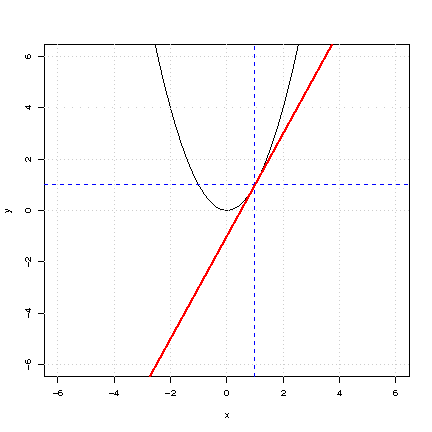

### Details

Imagine a nonlinear function whose graph is a curve described by the
equation,

 $y = f(x)$
.\
Here we want to find the slope of a line tangent to the curve at a
specific point  $(x_0)$
.

The slope of the line segment is given by the equation
 $\frac{f (x_0 +h) - f(x_0)} {h}$
.\
Reducing  $h$
 towards zero, gives the slope of this curve if it exists.

**Copyright** 2021, Gunnar Stefansson (editor) with contributions from
very many students

This work is licensed under the Creative Commons Attribution-ShareAlike
License. To view a copy of this license, visit
http://creativecommons.org/licenses/by-sa/1.0/ or send a letter to
Creative Commons, 559 Nathan Abbott Way, Stanford, California 94305,
USA.

# Derivatives

## The derivative as a limit

> The derivative of the function  $f$
>  at the point  $x$
>  is defined as
> 
> $$\lim_{h \to 0} \frac{f(x+h) - f(x)}{h}$$
> 
> if this limit exists.

### Details

> **Definition**:  
> 
> The derivative of the function  $f$
>  at the point  $x$
>  is defined as
> 
> $$\lim_{h \to 0} \frac{f(x+h) -f(x)}{h}$$
> 
> if this limit exists.

When we write  $y = f(x)$
, we commonly use the notation  $\frac{dy}{dx}$

or  $f'(x)$
 to denote the derivative.

## The derivative of  $f(x)=a+bx$

> If  $f(x) = a + bx$
>  then  $f(x + h) = a+ b(x + h) = a + bx + bh$
>  and thus
> 
> $$\lim_{h \to 0} \frac{f(x+h)-f(x)}{h} = \lim_{h \to 0} \frac{bh}{h}=b$$
> 
> 

### Details

If  $f(x) = a + bx$
 then  $f(x + h) = a+ b(x + h) = a + bx + bh$
 and thus

$$\lim_{h \to 0} \frac{f(x+h)-f(x)}{h} = \lim_{h \to 0} \frac{bh}{h}=b.$$

Thus  $f'(x)=b$
.

## The derivative of  $f(x)=x^n$

> If  $f(x)=x^n$
> , then  $f'(x)=nx^{n-1}$
> .

### Details

Let  $f(x)=x^n$
, where  $n$
 is a positive integer. To calculate  $f'$
 we
use the binomial theorem in the third step:

$$\begin{aligned}
\frac{f(x+h)-f(x)}{h}&=\frac{(x+h)^n-x^n}{h}\\
&=\frac{\sum_{q=0}^{n-1}\binom{n}{q}x^qh^{n-q}}{h}\\
&=\sum_{q=0}^{n-1}\binom{n}{q}x^qh^{n-q-1}\to\binom{n}{n-1}x^{n-1}=nx^{n-1}\end{aligned}$$

Thus, we obtain  $f'(x)=nx^{n-1}$
.

## The derivative of ln and exp

> If 
> 
> $$f(x)  = e^x$$
> 
>  then 
> 
> $$f'(x) = e^x$$
> 
> If 
> 
> $$g(x) = \ln(x)$$
> 
>  then 
> 
> $$g'(x) = \frac{1}{x}$$
> 

### Details

The derivatives of the exponential function is the exponential function
itself i.e.\
if 

$$f(x)  = e^x$$

 then 

$$f'(x) = e^x$$

The derivatives of the natural logarithm,  $\ln(x)$
, is  $\frac{1}{x}$
,
i.e. if 

$$g(x) = \ln(x)$$

 then 

$$g'(x) = \frac{1}{x}$$

## The derivative of a sum and linear combination

> If  $f$
>  and  $g$
>  are functions then the derivative of  $f+g$
>  is given by
>  $f' + g'$
> .

### Details

Similarly, the derivative of a linear combination is the linear
combination of the derivatives.

If  $f$
 and  $g$
 are functions and  $k(x)=af(x) + bg(x)$
 then
 $k'(x)=af'(x)+ bg'(x)$
.

### Examples

> **Example**:  
> 
> If  $f(x) = 2+3x$
>  and  $g(x)+x^3$
> \
> then we know that\
>  $f'(x)=3$
> ,  $g(x)=3x^2$
>  and if we write 
> 
> $$h(x)=f(x)+g(x)=2+3x+x^3$$
> 
>  then
> 
> $$h'(x)=3+3x^2$$
> 

## The derivative of a polynomial

> The derivative of a polynomial is the sum of the derivatives of the
> terms of the polynomial.

### Details

If

 $p(x)=a_0+a_1x+\dots +a_n x^n$

then

 $p'(x)=a_1+2a_2x+3a_3x^2+4a_4x^3+\dots +na_n x^{(n-1)}$

### Examples

> **Example**:  
> 
> If
> 
>  $p(x)=2x^4+x^3$
> 
> 
> then
> 
>  $p'(x)=2\frac{dx^4}{dx}+\frac{dx^3}{dx}=2 \cdot 4x^3 +3x^2 = 8x^3 +3x^2$
> 

## The derivative of a product

> If 
> 
> $$h(x)=f(x)\cdot g(x)$$
> 
>  then
> 
> $$h'(x)=f'(x)\cdot g(x)+f(x)\cdot g'(x)$$
> 

### Details

Consider two functions,  $f$
 and  $g$
 and their product,  $h$
:

$$h(x)=f(x)\cdot g(x).$$

 The derivative of the product is given by

$$h'(x)=f'(x)\cdot g(x)+f(x)\cdot g'(x).$$

### Examples

> **Example**:  
> 
> Suppose the function  $f$
>  is given by 
> 
> $$f(x)=xe^x+x^2\ln x .$$
> 
>  Then the
> derivative can be computed step by step as 
> 
> $$\begin{aligned}
> f(x)&=&\frac{dx}{dx}e^x+x\frac{de^x}{dx}+\frac{dx^2}{dx}\ln x +x^2\frac{d \ln x}{dx}\\
>     &=&1\cdot e^x +     x \cdot e^x     + 2x \cdot \ln x     + x^2 \cdot \frac{1}{x}\\
>     &=&e^x \left ( 1+x \right ) + 2x \ln  x +x\end{aligned}$$
> 

## Derivatives of composite functions

> If  $f$
>  and  $g$
>  are functions and  $h=f  \circ g$
>  so that\
>  $h(x) = f(g(x))$
>  then\
>  $h'(x) = \frac{dh(x)}{dx} = f'(g(x)) g'(x)$
> 

### Examples

> **Example**:  
> 
> For fixed  $x$
>  consider:
> 
> $$\begin{aligned}
>     f(p) &=& \ln(p^{x} (1-p)^{n-x})\\
>          &=& \ln p^{x} + \ln(1-p)^{n-x}\\
>          &=& x \ln p + (n-x) \ln (1-p)\\
>     \end{aligned}$$
> 
> Then the derivative is computed as follows:
> 
> $$\begin{aligned}
>   f'(p)&=& x \frac{1}{p} + \frac{n-x}{1-p}(-1)\\
>          &=& \frac{x}{p} - \frac{n-x}{1-p}\\
>     \end{aligned}$$
> 

> **Example**:  
> 
> For fixed  $x$
>  and  $y$
>  consider  $f(b) = (y-bx)^2$
> \
> Then the derivative is computed as follows:
> 
> $$\begin{aligned}
>     f'(b)&=& 2 (y-bx) (-x)\\
>          &=& -2x (y-bx)\\
>          &=&(-2xy) + (2x^2)b   
>     \end{aligned}$$
> 

**Copyright** 2021, Gunnar Stefansson (editor) with contributions from
very many students

This work is licensed under the Creative Commons Attribution-ShareAlike
License. To view a copy of this license, visit
http://creativecommons.org/licenses/by-sa/1.0/ or send a letter to
Creative Commons, 559 Nathan Abbott Way, Stanford, California 94305,
USA.

# Applications of differentiation

## Tracking the sign of the derivative

> If  $f$
>  is a function, then the sign of its derivative,  $f'$
> , indicates
> whether  $f$
>  is increasing ( $f'>0$
> ), decreasing ( $f'<0$
> ), or zero. If the
> derivative thakes the value 0 at a certain point  $x_0$
>  then the function
> has maximum, minimum, or a saddle point at  $x_0$
> .

### Details

-If  $f$
 is a function, then the sign of its derivative,  $f'$
, indicates
whether  $f$
 is increasing ( $f'>0$
), decreasing ( $f'<0$
), or zero.  $f'$

can be zero at points where  $f$
 has a maximum, minimum, or a saddle
point.\
-If  $f'(x)>0$
 for  $x< x_0$
,  $f'(x_0)=0$
 and  $f'(x)<0$
 for  $x>x_0$
 then
 $f$
 has a maximum at  $x_0$
 -If  $f'(x)<0$
 for  $x< x_0$
,  $f'(x_0)=0$
 and
 $f'(x)>0$
 for  $x>x_0$
 then  $f$
 has a minimum at  $x_0$
 -If  $f'(x)>0$
 for
 $x< x_0$
,  $f'(x_0)=0$
 and  $f'(x)>0$
 for  $x< x_0$
 then  $f$
 has a saddle
point at  $x_0$
 -If  $f'(x)<0$
 for  $x< x_0$
,  $f'(x_0)=0$
 and  $f'(x)<0$
 for
 $x< x_0$
 then  $f$
 has a saddle point at  $x_0$

### Examples

> **Example**:  
> 
> If  $f$
>  is a function such that its derivative is given by
> 
> $$f'(x) = (x-1)(x-2)(x-3)(x-4),$$
> 
>  then applying the above criteria for
> maxima and minima, we see that  $f$
>  has maxima at  $1$
>  and  $3$
>  and  $f$
>  has
> minima at  $2$
>  and  $4$
> .

## Describing extrema using  $f''$

> \- $x_0$
>  with  $f'(x_0)=0$
>  corresponds to a maximum if  $f''(x_0)<0$
>  - $x_0$
> 
> with  $f'(x_0)=0$
>  corresponds to a minimum if  $f''(x_0)>0$
> 

### Details

-If  $f'(x_0)=0$
 corresponds to a maximum, then the derivative is
decreasing and the second derivative cannot be positive, (i.e.
 $f''(x_0)\leq 0$
). In particular, if the second derivative is strictly
negative, ( $f''(x_0) <0$
), then we are assured that the point is indeed
a maximum, and not a saddle point.\
-If  $f'(x_0)=0$
 corresponds to a minimum, then the derivative is
increasing and the second derivative cannot be negative, (i.e.
 $f''(x_0) \geq 0$
).\
-If the second derivative is zero, then the point may be a saddle point,
as happens with  $f(x)=x^3$
 at  $x=0$
.

## The likelihood function

> If  $p$
>  is the probability mass function (p.m.f.): 
> 
> $$p(x) = P [X = x]$$
> 
> then the joint probability of obtaining a sequence of outcomes from
> independent sampling is
> 
> $$p(x_1) \cdot p(x_2) \cdot p(x_3) \ldots p(x_n)$$
> 
> Suppose each probability includes some parameter  $\theta$
> , this is
> written,
> 
> $${p_{\theta}}(x_1),  \ldots {p_{\theta}}(x_n)$$
> 
> If the experiment gives  $x_1, x_2 \ldots, x_n$
>  we can write the
> probability as a function of the parameters:
> 
> $$L_{\mathbf{x}}(\theta) = p_{\theta}(x_1),  \ldots , p_{\theta}(x_n).$$
> 
> This is the **likelihood function**.

### Details

> **Definition**:  
> 
> Recall that the **probability mass function (p.m.f)** is a function
> giving the probability of outcomes of an experiment.

We typically denote the p.m.f. by  $p$
 so  $p(x)$
 gives the probability of
a given outcome,  $x$
, of an experiment. The p.m.f. commonly depends on
some parameter. We often write,

$$p(x) = P [X = x].$$

If we take a sample of independent measurements, from  $p$
, then the
joint probability of a given set of numbers is,

$$p(x_1) \cdot p(x_2) \cdot p(x_3) \cdot \ldots \cdot p(x_n)$$

Suppose each probability includes the same parameter  $\theta$
, then this
is typically written,

$${p_{\theta}}(x_1), \ldots , {p_{\theta}}(x_n)$$

Now consider the set of outcomes  $x_1, x_2 \ldots, x_n$
 from the
experiment. We can now take the probability of this outcome as a
function of the parameters.

> **Definition**:  
> 
>  $L_{\mathbf{x}}(\theta) = p_{\theta}(x_1),  \ldots , p_{\theta}(x_n)$
> 
> 
> This is the **likelihood function** and we often seek to maximize it to
> estimate the unknown parameters.

### Examples

> **Example**:  
> 
> Suppose we toss a biased coin  $n$
>  independent times and obtain  $x$
> 
> heads, we know the probability of obtaining  $x$
>  heads is,
> 
> $$\binom{n}{x}p^x (1-p)^{n-x}$$
> 
> The parameter of interest is  $p$
>  and the likelihood function is,
> 
> $$L(p) = \binom{n}{x}p^x (1-p)^{n-x}$$
> 
> If  $p$
>  is unknown we sometimes wish to maximize this function with
> respect to  $p$
>  in order to estimate the *true* probability  $p$
> .

## Plotting the likelihood

> missing slide -- want to give a numeric example and plot  $L$
> 

### Examples

missing example -- want to give a numeric example and plot  $L$

## Maximum likelihood estimation

> If  $L$
>  is a likelihood function for a p.m.f.  $p_{\theta}$
> , then the
> value  $\hat{\theta}$
>  which gives the maximum of  $L$
> :
> 
> $$L (\hat{\theta}) = \max_\theta ({L}_\theta)$$
> 
>  is the maximum
> likelihood estimator (MLE) of  $\theta$
> 

### Details

> **Definition**:  
> 
> If  $L$
>  is a likelihood function for a p.m.f.  $p_{\theta}$
> , then the
> value  $\hat{\theta}$
>  which gives the maximum of  $L$
> :
> 
> $$L (\hat{\theta}) = \max_\theta ({L}_\theta)$$
> 
>  is the **maximum
> likelihood estimator** of  $\theta$
> 

### Examples

> **Example**:  
> 
> If  $x$
>  is the number of heads from  $n$
>  independent tosses of a coin, the
> likelihood function is:
> 
> $$L_x(p) = {n \choose x} p^x (1-p)^{n-x}$$
> 
> Maximizing this is equivalent to maximizing the logarithm of the
> likelihood, since logarithmic functions are increasing. The
> log-likelihood can be written as:
> 
> $$\ell(p) = \ln (L(p))= \ln \binom{n}{x} + x \ln (p) + (n-x) \ln (1-p).$$
> 
> To find possible maxima , we need to differentiate this formula and set
> the derivative to zero
> 
> $$0 = \frac{d \ell }{dp} = 0 + \frac{x}{p}+\frac{n-x}{1-p}(-1)$$
> 
> 
> 
> $$0 = p(1-p) \frac{(x)}{p} - p(1-p)  \frac{n-x}{1-p}$$
> 
> 
> 
> $$0 = (1-p)x  - p(n-x)$$
> 
> 
> 
> $$0 = x  - px -pn + px = x-pn$$
> 
> So,
> 
> $$0 =  x-pn$$
> 
> 
> 
> $$p = \frac{x}{n}$$
> 
> is the extreme and so we can write
> 
> $$\hat{p} = \frac{x}{n}$$
> 
> for the MLE.

## Least squares estimation

> Least squares: Estimate the parameters  $\theta$
>  by minimizing
> 
> $$\sum_{i=1}^{n}{(y_i - g_i (\theta))^2}$$
> 

### Details

Suppose we have a model linking data to parameters. In general we are
predicting  $y_i$
 as  $g_i$
 ( $\theta$
).

In this case it makes sense to estimate parameters  $\theta$
 by
minimizing 

$$\sum_{i=1}^{n}{(y_i - g_i (\theta))^2} .$$

### Examples

> **Example**:  
> 
> One may predict numbers,  $x_i$
> , as a mean,  $\mu$
> , plus error. Consider
> the simple model  $x_i = \mu + \epsilon_i$
> , where  $\mu$
>  is an unknown
> parameter (constant) and  $\epsilon_i$
>  is the error in measurement when
> obtaining the  $i^{th}$
>  observations,  $x_i$
> ,  $i=1,\ldots , n$
> .\
> A natural method to estimate the parameter is to minimize the squared
> deviations 
> 
> $$\min_{\mu} \sum_{i=1}^n \left (x - \mu \right )^2  .$$
> 
> It is not hard to see that the  $\hat{\mu}$
>  that minimizes this is the
> mean: 
> 
> $$\hat{ \mu} = \bar{x} .$$
> 

> **Example**:  
> 
> One also commonly predicts data  $y_1 , \cdots ,y_n$
>  with values on a
> straight line, i.e. with  $\alpha + \beta x_i$
> , where  $x_1, \ldots , x_n$
> 
> are fixed numbers.\
> This leads to the *r*egression problem of finding parameter values for
>  $\hat{\alpha}$
>  and  $\hat{\beta}$
>  which gives the best fitting straight
> line in relation to least squares:
> 
> $$\min_{\alpha,\beta} \sum \left ( y_i - ( \alpha + \beta x_i) \right ) ^2$$
> 

> **Example**:  
> 
> As a general exercise in finding the extreme of a function, let's look
> at the function  $f(\theta)=\Sigma_{i=1}^N(x_i\theta -3)^2$
>  where  $x_i$
> 
> are some constants. We wish to find the  $\theta$
>  that minimizes this
> sum. We simply differentiate  $\theta$
>  to obtain
> 
> $$f'(\theta)=\Sigma_{i=1}^n2(x_i\theta -3)x_1=2\sum_{i=1}^n x^2_i\theta -2\Sigma_{i=1}^n3x_i.$$
> 
> Thus,
> 
> $$\begin{aligned}
> f'(\theta)&=2\theta \Sigma_{i=1}^n x^2_i-2\Sigma_{i=1}^n3x_i=0\\
> &\Leftrightarrow \theta=\frac{\Sigma_{i=1}^n3x_i}{\Sigma_{i=1}^n x^2_i}.\end{aligned}$$
> 

**Copyright** 2021, Gunnar Stefansson (editor) with contributions from
very many students

This work is licensed under the Creative Commons Attribution-ShareAlike
License. To view a copy of this license, visit
http://creativecommons.org/licenses/by-sa/1.0/ or send a letter to
Creative Commons, 559 Nathan Abbott Way, Stanford, California 94305,
USA.

# Integrals and probability density functions

## Area under a curve

> The area under a curve between  $x=a$
>  and  $x=b$
>  (for a positive function)
> is called the integral of the function.
> 
> 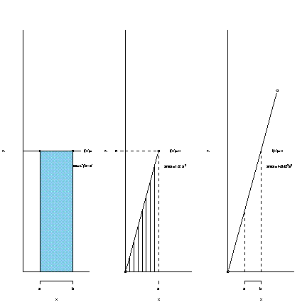
> 
> Figure: Example 1, 2 and 3

### Details

> **Definition**:  
> 
> The area under a curve between  $x=a$
>  and  $x=b$
>  (for a positive function)
> is called the **integral of the function** and is denoted:
>  $\int_{a}^{b} f(x)dx$
>  when it exists.

## The antiderivative

> Given a function  $f$
> , if there is another function  $F$
>  such that  $F'=f$
> ,
> we say that  $F$
>  is the *antiderivative* of  $f$
> . For a function  $f$
>  the
> antiderivative is denoted by  $\int f dx$
> .
> 
> Note that if  $F$
>  is one antiderivative of  $f$
>  and  $C$
>  is a constant,
> then  $G=F+C$
>  is also an antiderivative. It is therefore customary to
> always include the constant, e.g.  $\int x dx=\frac{1}{2}x^2+C$
> .

### Examples

> **Example**:  
> 
> The antiderivative of  $x$
>  to a power raises the power by one and devides
> it by the new power: 
> 
> $$\int x^n dx=\frac{1}{n+1}x^{n+1} +C.$$
> 

> **Example**:  
> 
>  $\int e^x dx=e^x+C$
> .

> **Example**:  
> 
>  $\int \frac{1}{x} dx=\ln(x)+C$
> .

> **Example**:  
> 
>  $\int 2xe^{x^2} dx=e^{x^2}+C$
> .

## The fundamental theorem of calculus

> If  $f$
>  is a continuous function, and  $F'(x)=f(x)$
>  for  $x\in[a,b]$
> , then
>  $\int_a^b f(x)dx=F(b)-F(a)$
> 

### Detail

It is not too hard to see that the area under the graph of a positive
function  $f$
 on the interval  $[a,b]$
 must be equal to the difference of
the values of its antiderivative at  $a$
 and  $b$
. This also holds for
functions which take on negative values and is formally stated below.

> **Definition**:  
> 
> **Fundamental theorem of calculus:** If  $F$
>  is the antiderivative of the
> continuous function  $f$
> , i.e.  $F'=f$
>  for  $x\in[a,b]$
> , then
>  $\int_a^b f(x)dx=F(b)-F(a)$
> .
> 
> This difference is often written as  $\int_a^b f dx$
>  or  $[F(x)]_a ^b$
> .

### Examples

> **Example**:  
> 
> The area under the graph of  $x^n$
>  between  $0$
>  and  $3$
>  is
>  $\int_0^3 x^n dx = [\frac{1}{n+1}x^{n+1}]_0 ^3=\frac{1}{n+1}3^{n+1}-\frac{1}{n+1}0^{n+1}=\frac{3^{n+1}}{n+1}$
> 

> **Example**:  
> 
> The area under the graph of  $e^x$
>  between  $3$
>  and  $4$
>  is
>  $\int_3^4 e^x dx =[e^x]_3 ^4= e^4-e^3$
> 

> **Example**:  
> 
> The area under the graph of  $\frac{1}{x}$
>  between  $1$
>  and  $a$
>  is
>  $\int_1^a \frac{1}{x} dx =[\ln(x)]_1 ^a= \ln(a)-\ln(1)=\ln(a).$
> 

## Density functions

> The probability density function (p.d.f.) and the cumulative
> distribution function (c.d.f.).
> 
> 

### Details

> **Definition**:  
> 
> If  $X$
>  is a random variable such that
> 
> $$P(a\leq X\leq b)=\int\limits^{b}_{a}f(x)dx,$$
> 
> \
> for some function  $f$
>  which satisfies  $f(x)\geq0$
>  for all  $x$
>  and
> 
> $$\int\limits^\infty_{-\infty} f(x)dx = 1$$
> 
> \
> then  $f$
>  is said to be a **probability density function (p.d.f.)** for
>  $X$
> .

> **Definition**:  
> 
> The functionThis distribution has the expected value
> 
> $$F(x)= \int\limits^{x}_{-\infty} f(t)dt$$
> 
> is the **cumulative distribution function (c.d.f.)**.

### Examples

> **Example**:  
> 
> Consider a random variable  $X$
>  from the uniform distribution, denoted by
>  $X\sim Unf(0,1)$
> . This distribution has density
> 
> $$f(x) = 
> \begin{cases}
>   1 &\text{if } 0 \leq x \leq 1\\
>   0 &\text{e.w.}
> \end{cases}.$$
> 
> The cumulative distribution function is given by
> 
> $$P[X\leq x] = \int\limits^{x}_{-\infty} f(t)dt = 
> \begin{cases}
>   0 & \text{if } x<0\\
>   x & \text{if } 0 \leq x \leq 1\\
>   1 & \text{else}
> \end{cases}.$$
> 

> **Example**:  
> 
> Suppose  $X \sim P(\lambda)$
> , where  $X$
>  may denote the number of events
> per unit time. The p.m.f. of  $X$
>  is described by
>  $p(x)=P[X=x]=e^{-\lambda}\frac{\lambda^x}{x!}$
>  for  $x=0,1,2,\dots$
> . Let
>  $T$
>  denote the waiting time between events, or simply until the first
> event. Consider the event  $T>t$
>  for some number  $t>0$
> . If
>  $X\sim p(\lambda)$
>  denotes the number of events per unit time, then let
>  $X_t$
>  be the number of events during the time period for  $0$
>  through
>  $t$
> . Then it is natural to assume  $X_t \sim P(\lambda t)$
>  and it follows
> that  $T>t$
>  if and only if  $X_t=0$
>  and we obtain
>  $P[T>t]=P[X_t=0]=e^{-\lambda t}$
> . It follows that the c.d.f. of  $T$
>  is
>  $F_T(t)=P[T\leq t]=1-P[T>t]=1-e^{-\lambda t}$
>  for  $t>0$
> .\
> The p.d.f. of  $T$
>  is therefore
>  $f_T(t)=F_T'(t)=\frac{d}{dt}F_T(t)=\frac{d}{dt}(1-e^{-\lambda t})=0-e^{- \lambda t} \cdot (-\lambda)=\lambda e^{-\lambda t}$
> 
> for  $t \geq 0$
>  and  $f_T(t)=0$
>  for  $t < 0$
> .\
> The resulting density
> 
> $$f(t) =
> \begin{cases}
>   \lambda e^{-\lambda t} & \text{for } t \geq0\\
>   0 & \text{for } t<0
> \end{cases}.$$
> 
> describes the exponential distribution.
> 
> This distribution has the expected value
> 
> $$E[T]=\int_{-\infty}^{\infty} tf(t)dt=\lambda \int_{0}^{\infty} t e^{-\lambda t}dt.$$
> 
> Let's use integration by parts (see below), i.e.:
>  $\int fg' = fg - \int f'g$
>  to solve that integral. Let  $f=t$
>  and
>  $g'=e^{-\lambda t}$
> . Then  $f' = 1$
>  and
>  $g=-\frac{e^{- \lambda t}}{\lambda}$
> . We obtain:
> 
> $$\begin{aligned}
>   &=\lambda \left( \left[ \frac{-te^{-\lambda t}}{\lambda}\right]_{0}^{\infty} - \int_0^\infty - \frac{-e^{-\lambda t}}{\lambda} dt \right)\\
>   &= \lambda \left( (0 - 0) - \left[ \frac{e^{-\lambda t}}{\lambda^2} \right]_0^\infty \right)\\
>   &= -\lambda \left(0 - \frac{1}{\lambda^2}\right)\\
>   &= \frac{1}{\lambda}\end{aligned}$$
> 

## Probabilities in R: The normal distribution

> R has functions to compute values of probability density functions
> (p.d.f.) and cumulative distribution functions (c.m.d.) for most common
> distributions.

### Details

The p.d.f. for the normal distribution is

$$p(t)=\frac{1}{\sqrt{2\pi}}e^{-\frac{t^2}{2}}$$

The c.d.f. for the normal distribution is

$$\Phi(x)=\int_{-\infty}^x\frac{1}{\sqrt{2\pi}}e^{-\frac{t^2}{2}}dt$$

### Examples

> **Example**:  
> 
>  $\verb|dnorm()|$
>  gives the value of the normal p.d.f.

> **Example**:  
> 
>  $\verb|pnorm()|$
>  gives the value of the normal c.d.f.

## Some rules of integration

### Examples

> **Example**:  
> 
> Using integration by parts we obtain
> 
> $$\int \ln(x)x dx= \frac{1}{2}x^2\ln(x)-\int \frac{1}{2}x^2\cdot \frac{1}{x} dx = \frac{1}{2}x^2\ln(x)-\int \frac{1}{2}x dx=\frac{1}{2}x^2\ln(x)-\frac{1}{4}x^2.$$
> 

> **Example**:  
> 
> Consider  $\int_1^2 2xe^{x^2} dx$
> . By setting  $x=g(t)=\sqrt{t}$
>  we obtain
> 
> $$\int_1^2 2xe^{x^2} dx = \int_1^4 2\sqrt{t}e^{t}\frac{1}{2\sqrt{t}}dt=\int_1^4 e^t dt=e^4-e.$$
> 

### Handout

The two most common \"tricks\" applied in integration are a) integration
by parts and b) integration by substitution.\
a) **Integration by parts**

$$(fg)'=f'g+fg'$$

 by integrating both sides of the equation we obtain:

$$fg=\int f'g dx + \int fg' dx \Leftrightarrow \int fg' dx=fg-\int f'g dx$$

\
b) **Integration by substitution**\
Consider the definite integral  $\int_a^b f(x) dx$
 and let  $g$
 be a
one-to-one differential function for the interval  $(c,d)$
 to  $(a,b)$
.
Then 

$$\int_a^b f(x) dx=\int_c^d f(g(y))g'(y) dy$$

**Copyright** 2021, Gunnar Stefansson (editor) with contributions from
very many students

This work is licensed under the Creative Commons Attribution-ShareAlike
License. To view a copy of this license, visit
http://creativecommons.org/licenses/by-sa/1.0/ or send a letter to
Creative Commons, 559 Nathan Abbott Way, Stanford, California 94305,
USA.

# Principles of programming

## Modularity

> Modularity involves designing a system that is divided into a set of
> functional units (named modules) that can be composed into a larger
> application.\
> Any programming project should be split into logical module pieces of
> code which are combined into a complete program.

### Details

Typically input, initialization, analysis, and output commands are
grouped into separate parts.

### Examples

> **Example**:  
> 
> Input
> 
>     dat<-read.table("http://notendur.hi.is/~gunnar/kennsla/alsm/data/set115.dat", header=T)
>     cols<- c("le", "osl")
> 
> Analysis
> 
>     Mn<-mean(dat[, cols[1]])
> 
> Output
> 
>     print (Mn)

## Modularity and functions

> In many cases groups of commands can be collected together into a
> function.

### Details

Typically a project has several such functions.

### Examples

> **Example**:  
> 
> Suppose you want to plot the weight vs. length for several datasets in
> 
> $$\verb|http://hi.is/~gunnar/kennsla/alsm/data|$$
> 
> A function can then be set up with the file number as an argument:
> 
>      plotwtle<-function (fnum){
>      fname<-paste(
>      "http://hi.is/~gunnar/kennsla/alsm/data/set",fnum,".dat",sep="")
>       cat("The URL B", fname,"\n")
>       dat<-read.table(fname,header=T)
>       ttl<-paste("Data from file number", fnum)
>       plot(dat$le,dat$osl,main=ttl)
>       }
> 
> Now call this with
> 
>     plotwtle(105)

## Modularity and files

> It is advisable to split larger projects into several manageable files.

### Details

Once a project reaches more than five lines of code, it should be stored
in one or more separate files. In order to combine these files a single
"source" command file can be created.\
Typically function definitions are stored in separate files, so one may
have several separate files like:\
\"input.r\"\
\"function.r\"\
\"analysis.r\"\
\"output.r\"\
While developing the analysis, the data would only be read once with\
source("input.r")\
The goal of this practice is to end up with a set of files which are
completely self-contained, so one can start with an empty R session and
give only the commands like:\
-  $\verb|source(“input.r”)|$
\
-  $\verb|source(“functions.r”)|$
\
-  $\verb|source(“analysis.r”)|$
\
Furthermore, this ensures repeatability.

### Examples

> **Example**:  
> 
> For a given project "input", "functions" "analysis" and "output" files
> can be created as below.
> 
> input.r:
> 
>     dat<-read.table("http://notendur.hi.is/~gunnar/kennsla/alsm/data/set115.dat", header=T)
> 
> functions.r:
> 
>     plotwtle<-function(fnum){
>      fname<-paste("http://notendur.hi.is/~gunnar/kennsla/alsm/data/set",fnum,".dat",sep="")
>       cat("The URL is",fname,"\n")
>       dat<-read.table(fname,header=T)
>       ttl<-paste("My data set was",fnum)
>       plot(dat$le,dat$osl,main=ttl,xlab="Length(cm)",ylab="Live weight (g)")
>     }
> 
> output.r:
> 
>     source("functions.r")
>     for(i in 101:150){
>       fnam<-paste("plot",i,".pdf",sep="")
>       pdf(fnam)
>       plotwtle(i)
>       dev.off()
>     }
> 
> These files can be executed with source commands as below:
> 
> >  $\verb|source (“input.r”)|$
> > 
> > 
> >  $\verb|source (“functions.r”)|$
> > 
> > 
> >  $\verb|source (“output.r”)|$
> > 

## Structuring an R project

### Details

We already covered how to split code into different functions and
linking them together with the help of one executable file that is
\"sourcing\" the others. However, when you undertake a larger project,
there will be a lot of different data and files and it is very advisable
to have a consistent structure throughout the project.\
A common project layout is to allocate all project files into a folder,
something along the lines of:

    /project
        /data
        /src
        /doc
        /figs (or /out)

Such a structure is quite normal in programming languages such as C,
Matlab, and R.\
Purpose of the different folders:\
/data: Contains all important data to the project, which you will use.
This folder should be read-only! No function is allowed to write
anything into this folder.\
\
/src: (abbreviation for \"source(-code)\") Here you will store all the
functions that you programmed. You can decide to store the executable
function here as well or, alternatively, have that one in the root
project folder.\
\
/doc: Contains further documentation material about your project. This
could be, for example, readme files for other people who use your
functions, or the paper you wrote about the project, or the latex files
while you're writing.\
\
/figs or /out: Here your functions are allowed to write and can produce
the different results, like graphs, figures or anything else.\
Finally, a large programming project should at some stage be split into
packages and stored on dedicated servers such as github or CRAN.

### Examples

> **Example**:  
> 
> Consider first the issue of maintaining the code itself. It is common
> for R beginners to only work interactively within the command-line
> interface. However, it is essential that the code be kept in one or more
> files.\
> For large projects these will be several different files, each with its
> own purpose. To run a complete analysis one would typically set up one
> file to run all the tasks by reading in data through analyses to
> outputs.\
> For example, a file named \"run.r\" could contain the sequence of
> commands:
> 
> > source(\"setup.r\")
> > 
> > source(\"analysis.r\")
> > 
> > source(\"plot.r\")

## Loops, for

> If a piece of code is to be run repeatedly, the for-loop is normally
> used.

### Details

If a piece of code is to be run repeatedly, the for-loop is normally
used. The R code form is:

        for(index in sequence){
        commands
        }

### Examples

> **Example**:  
> 
> To add numbers we can use
> 
>     tot <- 100
>     for(i in 1:100){
>       tot <- tot + i
>     }
>     cat ("the sum is ", tot, "\n")

> **Example**:  
> 
> Define the plot function
> 
> 
>     plotwtle <- AS BEFORE
> 
> To plot several of these we can use a sequence:
> 
>     plotwtle(101)
>     plotwtle(102)
>     .
>     .
>     .
> 
> or a loop
> 
>     for (i in 101:150){
>       fname<- paste("plot", i, ".pdf", sep="")
>       pdf(fname)
>       plotwtle(i)
>       dev.off()
>     }

## The if and ifelse commands

> The  $\verb|if|$
>  statement is used to conditionally execute statements.\
> The  $\verb|ifelse|$
>  statement conditionally replaces elements of a
> structure.

### Examples

> **Example**:  
> 
> If we want to compute  $x^x$
>  for  $x$
> -values in the range  $0$
>  through  $5$
> ,
> we can use
> 
>     xlist<-seq(0,5,0.01)
>     y<-NULL
>     for(x in xlist){
>       if(x==0){
>         y<-c(y,1)
>       }else{
>         y<-c(y,x**x)
>       }
>     }

> **Example**:  
> 
>     x<-seq(0,5,0.01)
>     y<-ifelse(x==0,1,x^x)

> **Example**:  
> 
>     dat<-read.table ("file")
>     dat<-ifelse (dat==0,0.01,dat)

> **Example**:  
> 
>     x<-ifelse (is.na(x),0,x)

## Indenting

> Code should be properly indented!

### Details

 $\verb|fFunctions|$
,  $\verb|for|$
-loops, and  $\verb|if|$
-statements
should always be indented.

## Comments

> All code should contain informative comments. Comments are separated out
> from code using the pound symbol (#).

### Examples

> **Example**:  
> 
>     ####################
>     #####SETUP DATA#####
>     ####################
> 
>     dat<-read.table(filename)
>     x<-log(dat$le)  #log-transformation of length
>     y<-log(dat$wt)  #log-transformation of weight
> 
>     ######################
>     #####THE ANALYSIS#####
>     ######################

**Copyright** 2021, Gunnar Stefansson (editor) with contributions from
very many students

This work is licensed under the Creative Commons Attribution-ShareAlike
License. To view a copy of this license, visit
http://creativecommons.org/licenses/by-sa/1.0/ or send a letter to
Creative Commons, 559 Nathan Abbott Way, Stanford, California 94305,
USA.

# The Central Limit Theorem and related topics

## The Central Limit Theorem

> If measurements are obtained independently and come from a process with
> finite variance, then the distribution of their mean tends towards a
> Gaussian (normal) distribution as the sample size increases.
> 
> 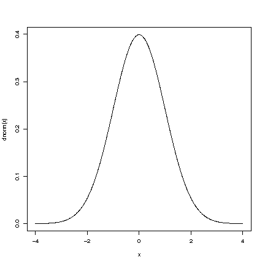
> 
> Figure: The standard normal density

### Details

> The **Central Limit Theorem** states that if  $X_1, X_2, \ldots$
>  are
> independent and identically distributed random variables with mean  $\mu$
> 
> and (finite) variance  $\sigma^2$
> , then the distribution of
>  $\bar{X}_n:= \frac{X_1+\dots+X_n}{n}$
>  tends towards a normal
> distribution.

It follows that for a large enough sample size  $n$
, the distribution
random variable  $\bar{X}_n$
 can be approximated by  $N(\mu,\sigma^2/n)$
.

The standard normal distribution is given by the p.d.f.

$$\varphi(z) = \frac{1}{\sqrt{2\pi}} e^{\frac{-z^2}{2}}$$

 for
 $z\in \mathbb{R}$
.\
The standard normal distribution has an expected value of zero,

$$\mu = \int z\varphi (z)dz =0$$

 and a variance of

$$\sigma^2 = \int ({z-\mu})^2 \varphi(z)dz=1$$

If a random variable  $Z$
 has the standard normal (or Gaussian)
distribution, we write  $Z\sim N(0,1)$
.

If we define a new random variable,  $Y$
, by writing  $Y=\sigma Z + \mu$
,
then  $Y$
 has an expected value of  $\mu$
, a variance of  $\sigma^2$
 and a
density (p.d.f.) given by the formula:

$$f(y) = \frac{1}{\sqrt{2\pi}\sigma}   \ e^{\frac{-(y-\mu)^2}{2\sigma^2}}.$$

This is general normal (or Gaussian) density, with mean  $\mu$
 and
variance  $\sigma^2$
.

The Central Limit Theorem states that if you take the mean of several
independent random variables, the distribution of that mean will look
more and more like a Gaussian distribution (if the variance of the
original random variables is finite).

More precisely, the cumulative distribution function of

$$\frac{\bar{X}_n - \mu}{\sigma/\sqrt{n}}$$

 converges to  $\Phi$
, the
 $N(0,1)$
 cumulative distribution function.

### Examples

> **Example**:  
> 
> If we collect measurements on waiting times, these are typically assumed
> to come from an exponential distribution with density
> 
> $$f(t)=\lambda e^{-\lambda t},\textrm{ for } t>0$$
> 
> The Central Limit Theorem states that the mean of several such waiting
> times will tend to have a normal distribution.

> **Example**:  
> 
> We are often interested in computing
> 
> $$w=\frac{\bar{x}-\mu_0}{\frac{s}{\sqrt{n}}}$$
> 
>  which comes from a  $T$
> 
> distribution (see below), if the  $x_i$
>  are independent outcomes from a
> normal distribution.
> 
> However, if  $n$
>  is large and  $\sigma^2$
>  is finite then  $w$
>  values will
> look as though they came from a normal distribution. This is in part a
> consequence of the Central Limit Theorem, but also of the fact that  $s$
> 
> will become close to  $\sigma$
>  as  $n$
>  increases.

## Properties of the binomial and Poisson distributions

> The binomial distribution is really a sum of  $0$
>  and  $1$
>  values (counts
> of failures  $= 0$
>  and successes  $=1$
> ). So, a simple, single binomial
> outcome will correspond to coming from a normal distribution if the
> count is large enough.

### Details

Consider the binomial probabilities:

$$p(x)=\binom{n}{x}p^x(1-p)^{n-x}$$

for  $x=0,1,2,3, \cdots,n$
 where  $n$
 is a non-negative integer. Suppose
 $p$
 is a small positive number, specifically consider a sequence of
decreasing  $p$
-values, specified with  $p_n= \frac{\lambda}{n}$
 and
consider the behavior of the probability as  $n \rightarrow \infty$
. We
obtain:

$$\begin{aligned}
\binom{n}{x}p_n^x(1-p_n)^{n-x}& = &\frac{n!}{x!(n-x!)} \left ( \frac{\lambda}{n} \right )^x \left ( 1-\frac{\lambda}{n} \right )^{n-x}\\
& = &\frac{N(n-1)(n-2)\cdots (n-x+1)}{x!} \frac{\frac{\lambda}{n}^x}{\left ( 1-\frac{\lambda}{n} \right ) ^x} \left ( 1-\frac{\lambda}{n} \right )^n\\
& = &\frac{N(n-1)(n-2)\cdots (n-x+1)}{x!n^x} \frac{\lambda^x}{\left ( 1-\frac{\lambda}{n} \right ) ^x} \left ( 1-\frac{\lambda}{n} \right )^n\end{aligned}$$

> **Note**:  
> 
> *Note 17*. Notice that  $\frac{N(n-1)(n-2)\cdots (n-x+1)}{n^x}\to 1$
>  as
>  $n\to\infty$
> . Also notice that  $(1-\frac{\lambda}{n})^x\to 1$
>  as
>  $n\to\infty$
> . Also
> 
> $$\lim_{n \to \infty} \bigg( 1-\frac{\lambda}{n} \bigg) = e^{- \lambda}$$
> 
> and it follows that
> 
> $$\lim_{n \to \infty} \binom{n}{x}p_n^x(1-p_n)^{n-x} = \frac{e^{- \lambda} \lambda^x}{x!}, x= 0,1,2, \cdots , n$$
> 
> and hence the binomial probabilities may be approximated with the
> corresponding Poisson.

### Examples

> **Example**:  
> 
> The mean of a binomial (n,p) variable is  $\mu=n\cdot p$
>  and the variance
> is  $\sigma^2=np(1-p)$
> .\
> The R command  $\verb|dbinom(q,n,p)|$
>  calculates the probability of  $q$
> 
> successes in  $n$
>  trials assuming that the probability of a success is
>  $p$
>  in each trial (binomial distribution), and the R command
>  $\verb|pbinom(q,n,p)|$
>  calculates the probability of obtaining  $q$
>  or
> fewer successes in  $n$
>  trials.
> 
> The normal approximation of this distribution can be calculated with
>  $\verb|pnorm(q,mu,sigma)|$
>  which becomes
>  $\verb|pnorm|(q,np,sqrt(np(1-p))|$
> . Three numerical examples (note that
> pbinom and pnorm give similar values for large n):
> 
>     pbinom(3,10,0.2)
>     [1] 0.8791261
>     pnorm(3,10*0.2,sqrt(10*0.2*(1-0.2)))
>     [1] 0.7854023
> 
>     pbinom(3,20,0.2)
>     [1] 0.4114489
>     pnorm(3,20*0.2,sqrt(20*0.2*(1-0.2)))
>     [1] 0.2880751
> 
>     pbinom(30,200,0.2)
>     [1] 0.04302156
>     pnorm(30,200*0.2,sqrt(200*0.2*(1-0.2)))
>     [1] 0.03854994

> **Example**:  
> 
> We are often interested in computing  $w=\frac{\bar{x}-\mu}{s/\sqrt{n}}$
> 
> which has a  $T$
>  distribution if the  $x_i$
>  are independent outcomes from
> a normal distribution. If  $n$
>  is large and  $\sigma^2$
>  is finite, this
> will look as if it comes from a normal distribution.\
> The numerical examples below demonstrate how the  $T$
>  distribution
> approaches the normal distribution.
> 
>     qnorm(0.7)
>     [1] 0.5244005 
>     #This is the value which gives the cumulative probability of p=0.7 for a n~(0,1)
>     qt(0.7,2)
>     [1] 0.6172134
>     #The value, which gives the cumulative probability of p=0.7 with n=2 for the t distribution.
>     qt(0.7,5)
>     [1] 0.5594296
>     qt(0.7,10)
>     [1] 0.541528
>     qt(0.7,20)
>     [1] 0.5328628
> 
> 
>     qt(0.7,100)
>     [1] 0.5260763

## Monte Carlo simulation

> If we know an underlying process we can simulate data from the process
> and evaluate the distribution of any quantity based on such data.
> 
> 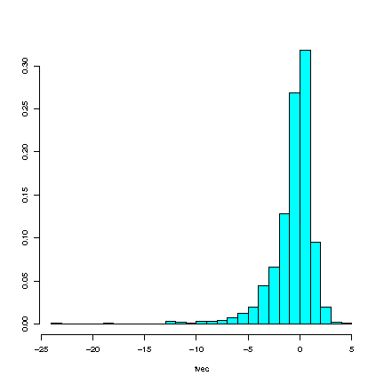
> 
> Figure: A simulated set of  $t$
> -values based on data from an exponential
> distribution.

### Examples

> **Example**:  
> 
> Suppose our measurements come from an exponential distribution and we
> want to compute
> 
> $$t = \frac{\overline x - \mu}{s / \sqrt{n}}$$
> 
> but we want to know the distribution of those when  $\mu$
>  is the true
> mean.\
> For instance,  $n=5$
>  and  $\mu = 1$
> , we can simulate (repeatedly)
>  $x_1, \ldots , x_5$
>  and compute a  $t$
> -value for each. The following R
> commands can be used for this:
> 
>     library(MASS)
>     n<-5          
>     mu<-1         
>     lambda<-1     
>     tvec<-NULL    
>     for(sim in 1:10000){ 
>        x<-rexp(n,lambda)  
>        xbar<-mean(x)      
>        s<-sd(x)           
>        t<-(xbar-mu)/(s/sqrt(n)) 
>        tvec<-c(tvec,t)          
>     }                       
> 
>     #then do...                
> 
>      truehist(tvec)     #truehist gives a better histogram 
>      sort(tvec)[9750]     
>      sort(tvec)[250]      

**Copyright** 2021, Gunnar Stefansson (editor) with contributions from
very many students

This work is licensed under the Creative Commons Attribution-ShareAlike
License. To view a copy of this license, visit
http://creativecommons.org/licenses/by-sa/1.0/ or send a letter to
Creative Commons, 559 Nathan Abbott Way, Stanford, California 94305,
USA.

# Miscellanea

## Simple probabilities in R

> R has functions to compute probabilities based on most common
> distributions.\
> \
> If  $X$
>  is a random variable with a known distribution, then R can
> typically compute values of the cumulative distribution function or:
> 
> $$F(x)=P[X \leq x]$$
> 

### Examples

> **Example**:  
> 
> If  $X \sim Bin(n,p)$
>  has binomial distribution, i.e.
> 
> $$P(X = x) = {n \choose x}p^x(1-p)^{n-x},$$
> 
>  then cumulative
> probabilities can be computed with  $\verb|pbinom|$
> , e.g.
> 
>     pbinom(5,10,0.5) 
> 
> gives 
> 
> $$P[X \leq 5] = 0.623$$
> 
>  where 
> 
> $$X \sim Bin(n=10,p= \frac{1}{2}).$$
> 
> This can also be computed by hand. Here we have  $n=10$
> ,  $p=1/2$
>  and the
> probability  $P[X \leq 5]$
>  is obtained by adding up the individual
> probabilities,  $P[X =0]+P[X =1]+P[X =2]+P[X =3]+P[X =4]+P[X =5]$
> 
> 
> $$P[X \leq 5]  = \sum_{x=0}^5 {10\choose x} \frac{1}{2}^x\frac{1}{2}^{10-x}.$$
> 
> This becomes
> 
> $$P[X \leq 5]  = {10\choose 0} \frac{1}{2}^0\frac{1}{2}^{10-0} +{10\choose 1} \frac{1}{2}^1\frac{1}{2}^{10-1}+{10\choose 1} \frac{1}{2}^2\frac{1}{2}^{10-2}+{10\choose 3} \frac{1}{2}^3\frac{1}{2}^{10-3}+{10\choose 4} \frac{1}{2}^4\frac{1}{2}^{10-4}+{10\choose 5} \frac{1}{2}^5\frac{1}{2}^{10-5}$$
> 
> or
> 
> $$P[X \leq 5]  = {10\choose 0} \frac{1}{2}^{10} +{10\choose 1} \frac{1}{2}^{10}+{10\choose 1} \frac{1}{2}^{10}+{10\choose 3} \frac{1}{2}^{10}+{10\choose 4} \frac{1}{2}^{10}+{10\choose 5} \frac{1}{2}^{10}=\frac{1}{2}^{10} \left(1+10+45+\dots \right).$$
> 
> Furthermore,
> 
>     pbinom(10,10,0.5)
>     [1] 1
> 
> and
> 
>     pbinom(0,10,0.5) 
>     [1] 0.0009765625
> 
> It is sometimes of interest to compute  $P[X=x]$
>  in this case, and this
> is given by the  $\verb|dbinom|$
>  function, e.g.
> 
>     dbinom(1,10,0.5)
>     [1] 0.009765625
> 
> or  $\frac{10}{1024}$
> 

> **Example**:  
> 
> Suppose  $X$
>  has a uniform distribution between  $0$
>  and  $1$
> , i.e.
>  $X \sim Unf(0,1)$
> . Then the  $punif$
>  function will return probabilities
> of the form
> 
> $$P[X \leq x]= \int_{-\infty}^{x} f(t)dt= \int_{0}^{x} f(t)dt$$
> 
> where  $f(t)=1$
>  if  $0 \leq t \leq 1$
>  and  $f(t)=0$
> . For example:
> 
>     punif(0.75)
>     [1]  0.75
> 
> To obtain  $P[a \leq X \leq b],$
>  we use  $punif$
>  twice, e.g.
> 
>     punif(0.75)-punif(0.25)
>     [1]  0.5

## Computing normal probabilities in R

> To compute probabilities  $X\sim N(\mu,\sigma^2)$
>  is usually transformed,
> since we know that 
> 
> $$Z:=\frac{X-\mu}{\sigma} \sim(0,1)$$
> 
>  The
> probabilities can then be computed for either  $X$
>  or  $Z$
>  with the
>  $\verb|pnorm|$
>  function in R.

### Details

Suppose  $X$
 has a normal distribution with mean  $\mu$
 and variance

$$X\sim N(\mu,\sigma^2)$$

 then to compute probabilities,  $X$
 is usually
transformed, since we know that 

$$Z=\frac{X-\mu}{\sigma} \sim(0,1)$$

 and
the probabilities can be computed for either  $X$
 or  $Z$
 with the
 $\verb|pnorm|$
 function.

### Examples

> **Example**:  
> 
> If  $Z \sim N(0,1)$
>  then we can e.g. obtain  $P[Z\leq1.96]$
>  with
> 
>     pnorm(1.96)
>     [1] 0.9750021
> 
>     pnorm(0)
>     [1] 0.5
> 
>     pnorm(1.96)-pnorm(1.96)
>     [1] 0
> 
>     pnorm(1.96)-pnorm(-1.96)
>     [1] 0.9500042
> 
> The last one gives the area between  $-1.96$
>  and  $1.96$
> .

> **Example**:  
> 
> If  $X \sim N(42,3^2)$
>  then we can compute probabilites either by
> transforming 
> 
> $$\begin{aligned}
> P[X\leq x] &= P\left[\frac{X-\mu}{\sigma} \leq \frac{x-\mu}{\sigma}\right]\\
>            &= P\left[Z \leq \frac{x-\mu}{\sigma}\right]\end{aligned}$$
> 
> and calling  $\verb|pnorm|$
>  with the computed value
>  $z=\frac{x-\mu}{\sigma}$
> , or call  $\verb|pnorm|$
>  with  $x$
>  and specify
>  $\mu$
>  and  $\sigma$
> .\
> \
> To compute  $P[X\leq 48]$
> , either set  $z=(48-42)/3=2$
>  and obtain
> 
>     pnorm(2)
>     [1] 0.9772499
> 
> or specify  $\mu$
>  and  $\sigma$
> 
> 
>     pnorm(42,42,3)
>     [1] 0.5

## Introduction to hypothesis testing

### Details

If we have a random sample  $x_1, \ldots , x_n$
 from a normal
distribution, then we consider them to be outcomes of independent random
variables  $X_1, \ldots , X_n$
 where  $X_i \sim N(\mu, \sigma^2)$
.
Typically,  $\mu$
 and  $\sigma^2$
 are unknown but assume for now that
 $\sigma^2$
 is known.\
Consider the hypothesis:\
 $H_0: \mu = \mu_0$
 vs.  $H_1: \mu > \mu_0$
\
where  $\mu_0$
 is a specified number.\
Under the assumption of independence, the sample mean

$$\overline{x} = \frac{1}{n} \sum^n_{i=1}x_i$$

is also an observation from a normal distribution, with mean  $\mu$
 but a
smaller variance.Specifically,  $\overline{x}$
 is the outcome of

$$\overline{X} = \frac{1}{n} \sum^n_{i=1}X_i$$

and

$$X \sim N(\mu, \frac{ \sigma^2}{n})$$

so the standard deviation of  $X$
 is  $\frac{\sigma}{\sqrt{n}}$
, so the
appropriate error measure for  $\overline{x}$
 is
 $\frac{\sigma}{\sqrt{n}}$
, when  $\sigma$
 is unknown.\
If  $H_0$
 is true, then

$$z:= \frac{\overline{x}-\mu_0}{\sigma / \sqrt{n}}$$

is an observation from an  $n \sim N (0,1)$
 distribution, i.e. an outcome
of

$$Z= \frac{\overline{X}-\mu_0}{\sigma / \sqrt{n}}$$

where  $Z \sim N(0,1)$
 when  $H_0$
 is correct. It follows that e.g.
 $P[\vert Z \vert > 1.96] = 0.05$
 and if we observe
 $\vert Z \vert > 1.96$
 then we reject the null hypothesis.\
Note that the value  $z^\ast = 1.96$
 is a quantile of the normal
distribution and we can obtain other quantiles with the  $\verb|pnorm|$

function, e.g.  $\verb|pnorm|(0.975)|$
 gives  $1.96$
.

**Copyright** 2021, Gunnar Stefansson (editor) with contributions from
very many students

This work is licensed under the Creative Commons Attribution-ShareAlike
License. To view a copy of this license, visit
http://creativecommons.org/licenses/by-sa/1.0/ or send a letter to
Creative Commons, 559 Nathan Abbott Way, Stanford, California 94305,
USA.
